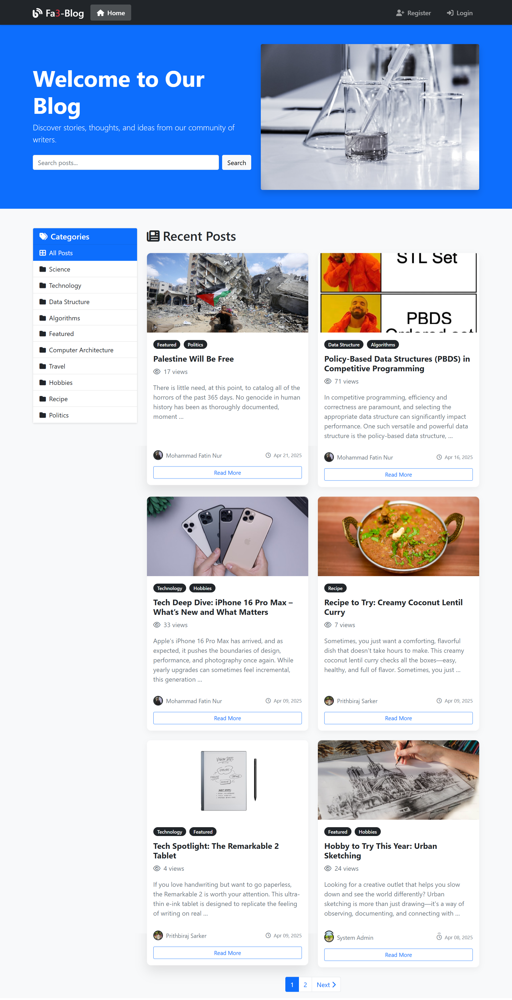
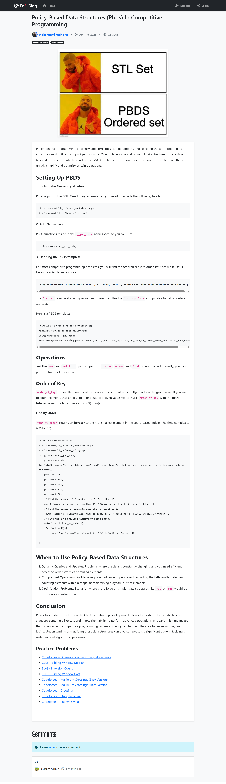
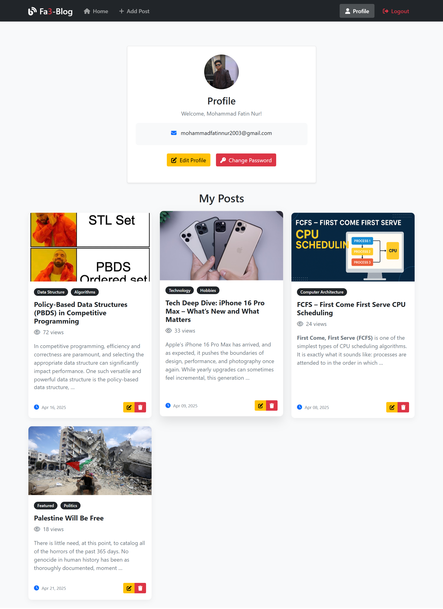

# Fa3-Blog: Django Blog Project

[](https://djangoproject.com/)
[](https://python.org/)
[](LICENSE)

A modern, feature-rich blog application built with Django. Fa3-Blog provides a clean, responsive interface for creating, managing, and sharing blog posts with an intuitive user experience.

## ✨ Features

### 🔐 User Management
- **User Registration & Authentication**: Secure user registration and login system
- **User Profiles**: Customizable user profiles with profile pictures and bio
- **Role-based Access**: Different access levels for regular users and administrators
- **Password Management**: Change password functionality with proper validation

### 📝 Content Management
- **Rich Text Editor**: CKEditor 5 integration for creating beautiful, formatted content
- **Image Uploads**: Support for post images and profile pictures
- **Categories**: Organize posts with multiple categories
- **Search Functionality**: Search posts by title and content
- **View Counter**: Track post popularity with view counts

### 💬 Social Features
- **Commenting System**: Hierarchical commenting with reply functionality
- **User Interaction**: Comment on posts and engage with other users
- **Author Pages**: View posts by specific authors

### 🎨 Design & UX
- **Responsive Design**: Mobile-friendly Bootstrap 5 interface
- **Dynamic Hero Images**: Random header images from Unsplash API
- **Pagination**: Efficient content pagination for better performance
- **Clean UI**: Modern, intuitive user interface

### 🛠️ Administrative Features
- **Admin Panel**: Django admin interface for content management
- **User Management**: Superuser can manage all users
- **Category Management**: Add and manage blog categories
- **Content Moderation**: Full control over posts and comments

## 📸 Screenshots

### Home Page

*The main blog homepage featuring recent posts, search functionality, and category navigation*

### Post Detail View

*Individual post view with rich content, comments section, and social interaction features*

### User Profile

*User profile page showing personal posts, profile information, and management options*

## 🚀 Quick Start

### Prerequisites
- Python 3.8 or higher
- pip (Python package installer)
- Git

### Installation

1. **Clone the repository**
   ```bash
   git clone "https://github.com/Fatin007/blog_project_fa3.git"
   cd blog_project_fa3
   ```

2. **Create a virtual environment**
   ```bash
   python -m venv venv
   
   # On Windows
   venv\Scripts\activate
   
   # On macOS/Linux
   source venv/bin/activate
   ```

3. **Install dependencies**
   ```bash
   pip install -r requirements.txt
   ```

4. **Environment Setup**
   Create a `.env` file in the root directory:
   ```env
   SECRET_KEY=your-secret-key-here
   DJANGO_ENVIRONMENT=development
   DEBUG=True
   ```

5. **Database Setup**
   ```bash
   python manage.py makemigrations
   python manage.py migrate
   ```

6. **Create Superuser**
   ```bash
   python manage.py createsuperuser
   ```

7. **Run the Development Server**
   ```bash
   python manage.py runserver
   ```

8. **Access the Application**
   Open your browser and navigate to `http://127.0.0.1:8000/`

## 🏗️ Project Structure

```
blog_project_fa3/
├── author/                 # User authentication and profiles
│   ├── models.py          # UserProfile model
│   ├── views.py           # Authentication views
│   ├── forms.py           # User forms
│   └── templates/         # Auth templates
├── posts/                 # Blog posts functionality
│   ├── models.py          # Post and Comment models
│   ├── views.py           # Post CRUD operations
│   ├── forms.py           # Post and comment forms
│   └── templates/         # Post templates
├── categories/            # Blog categories
│   ├── models.py          # Category model
│   ├── views.py           # Category management
│   └── forms.py           # Category forms
├── home/                  # Home page and main views
│   ├── views.py           # Home page logic
│   └── templates/         # Home templates
├── static/                # Static files (CSS, JS, images)
├── media/                 # User uploads
├── templates/             # Shared templates
│   └── base.html          # Base template
├── blog_project/          # Django project settings
│   ├── settings.py        # Project configuration
│   └── urls.py            # URL routing
├── requirements.txt       # Python dependencies
└── manage.py             # Django management script
```

## 🔧 Configuration

### Environment Variables
The project uses environment variables for configuration:

- `SECRET_KEY`: Django secret key
- `DJANGO_ENVIRONMENT`: Set to 'development' or 'production'
- `DEBUG`: Enable/disable debug mode
- `DATABASE_URL`: Database connection string (for production)

### Database Configuration
- **Development**: SQLite (default)
- **Production**: PostgreSQL support with environment-based configuration

### Media Files
- **Development**: Local file storage
- **Production**: Cloudinary integration for image hosting

## 🎯 Key Features in Detail

### Rich Text Editor
The blog uses CKEditor 5 with extensive formatting options:
- Text formatting (bold, italic, underline)
- Headings and lists
- Code blocks and syntax highlighting
- Image insertion and styling
- Tables and media embeds

### User Authentication
Comprehensive user management system:
- Registration with email validation
- Secure login/logout
- Profile management with image uploads
- Password change functionality
- Admin user management panel

### Content Organization
- **Categories**: Posts can belong to multiple categories
- **Search**: Full-text search across post titles and content
- **Pagination**: Efficient loading of large content sets
- **View Tracking**: Popular posts identification

### Comment System
Hierarchical commenting with:
- Nested replies
- User authentication required
- Form validation
- Real-time interaction

## 🛡️ Security Features

- CSRF protection
- SQL injection prevention
- XSS protection
- Secure password hashing
- Environment-based configuration
- Production security settings

## 🚀 Deployment

### Production Setup
The project is configured for deployment on platforms like Render, Railway, or Heroku:

1. Set environment variables for production
2. Configure PostgreSQL database
3. Set up Cloudinary for media files
4. Enable production security settings

### Build Script
Use the included `build.sh` for automated deployment:
```bash
./build.sh
```

## 🤝 Contributing

1. Fork the project
2. Create your feature branch (`git checkout -b feature/amazing-feature`)
3. Commit your changes (`git commit -m 'Add some amazing feature'`)
4. Push to the branch (`git push origin feature/amazing-feature`)
5. Open a Pull Request

## 📝 License

This project is licensed under the MIT License - see the [LICENSE](LICENSE) file for details.

## 🙏 Acknowledgments

- Django framework for the robust backend
- Bootstrap 5 for responsive design
- CKEditor 5 for rich text editing
- Unsplash API for dynamic hero images
- Cloudinary for media management

## 📞 Support

If you encounter any issues or have questions, please:
1. Check the [Issues](../../issues) section
2. Create a new issue if your problem isn't already reported
3. Provide detailed information about your environment and the issue

---

**Built with ❤️ using Django**
